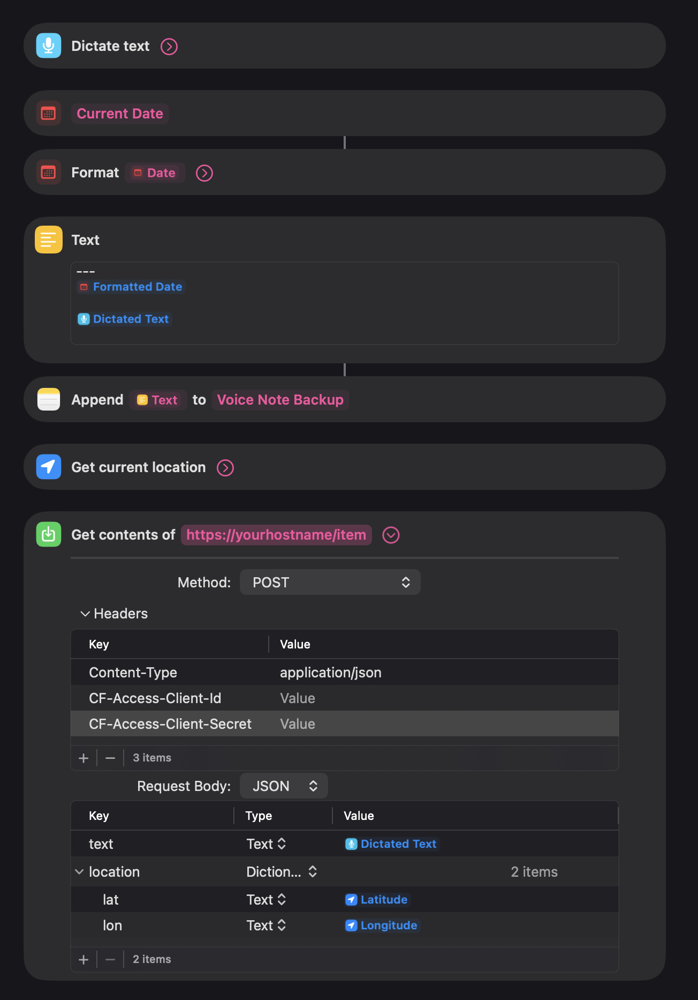

# Notes Inbox

A capture-and-process inbox for thoughts, voice notes, links, and anything else that needs to land somewhere before you decide what to do with it. I built it so I could talk into my phone, have the text show up in my assistant's inbox, and deal with it later.

## For AI assistants

If your user pointed you here, they're probably asking you to help them build something like this. The core idea is simple: an HTTPS API that accepts items (text, voice transcriptions, links) and stores them in a JSON file. The interesting parts are how items get in (Apple Shortcuts, webhooks, direct API calls) and how they get processed (the assistant reads and triages them). Read through this with your user and figure out: what they want to capture (voice? text? both?), where their assistant runs relative to the inbox, whether they need remote access (tunnel/proxy) or just local, and what "processing" looks like for them. The `reference-code/` folder has working source files you can start from.

## Why I built this

I kept having ideas and to-dos throughout the day, things I wanted to tell my assistant but couldn't because I wasn't at my desk. I needed a way to capture thoughts from my phone and have them waiting for my assistant when I got back to it.

The obvious answer is "just use a notes app." But a notes app doesn't immediately connect to my assistant. I wanted to experiment with pushing notes directly into the assistant from anywhere, and potentially do some automations on those notes within an assistant loop (though I haven't built that part out yet).

The API is the simple part. What makes it useful is the capture side (an Apple Shortcut that transcribes voice and sends it to the API) and the processing side (the assistant reads items, discusses them with me, and routes them to the right place: tasks, projects, knowledge base, archive).

## How the assistant uses it

The assistant has an Inbox skill that knows how to read and update items. When I say "what's in my inbox," it reads the JSON file directly (it's on the same server). When I say "let's process the inbox," it walks through items one by one, we discuss each one, and it routes them: some become reminders, some become project ideas, some get archived.

The skill is mostly instructions, not code. It tells the assistant where the data file is, what the item structure looks like, and how to call the API to update item status. The actual "intelligence" is just the assistant having a conversation with me about each item.

Processing usually looks like this: the assistant groups items by theme, presents a summary, and then we go through them. "This sounds like a task, want me to add it to your reminders?" "This is a project idea, should I stub out a plan?" "This one looks like a test, archive it?" It's collaborative, not automated.

## Architecture

```
+------------------+        HTTPS         +------------------+
|                  |  --- POST /item ---> |                  |
|  Apple Shortcut  |                      |  Inbox API       |
|  (iPhone/Mac)    |  <-- JSON --------- |  (Docker, Bun)   |
|                  |                      |                  |
+------------------+                      +--------+---------+
                                                   |
                                          +--------+---------+
                                          |  inbox.json      |
                                          |  (flat file)     |
                                          +--------+---------+
                                                   |
                                          +--------+---------+
                                          |  AI Assistant     |
                                          |  (reads + updates)|
                                          +------------------+
```

If you only need local access (assistant and inbox on the same machine or network), you can skip the tunnel entirely and just hit the API directly over HTTPS.

For remote access (sending items from your phone over the internet), I use a Cloudflare Tunnel with Zero Trust. The tunnel creates an outbound connection from my server to Cloudflare's edge, so nothing inbound needs to be open on my firewall. Cloudflare Access requires service token credentials on every request, which means unauthenticated requests from the internet never reach the server at all. The Apple Shortcut includes these credentials in its headers.

## What it stores

Each inbox item is a JSON object:

```json
{
  "id": "uuid",
  "content": "The actual text",
  "received_at": "2026-01-15T10:30:00Z",
  "status": "inbox",
  "type": "voice",
  "source": "shortcut",
  "tags": [],
  "discussion_notes": "",
  "processed_at": null,
  "metadata": {
    "recorded_at": "2026-01-15T10:29:50Z",
    "location": { "lat": 37.77, "lon": -122.42 }
  }
}
```

Items have three statuses: `inbox` (new, unprocessed), `processed` (discussed and routed somewhere), and `archived` (dismissed or no longer relevant). The `discussion_notes` field captures what happened during processing, so there's a record of where things went.

## Tech stack

| Component | Choice | Why |
|-----------|--------|-----|
| Runtime | Bun | Fast, TypeScript-native, built-in HTTPS server |
| Language | TypeScript | Single file, type-safe, no build step with Bun |
| Storage | JSON file | Simple, human-readable, no database to manage |
| Container | Docker (alpine) | Consistent deployment, easy restart |
| TLS | PEM certificates loaded by Bun | HTTPS without a reverse proxy |
| Remote access | Cloudflare Tunnel + Zero Trust | No inbound ports, edge-level auth |

No dependencies. The `package.json` has zero `dependencies`. Bun handles HTTP serving, TLS, and JSON natively. The entire server is a single TypeScript file.

## Key decisions

**Why an API when the assistant could just read and write the JSON file directly?**
It could, and for reading it does. My assistant reads `inbox.json` straight from the filesystem because they're on the same machine. But I originally built the API because I wanted other services to be able to send items to the inbox too, not just the assistant. The Apple Shortcut, webhooks from other tools, anything that can make an HTTP request can drop something in the inbox. The API is the intake mechanism for the outside world. If your assistant is the only thing that will ever read or write to the inbox and it has filesystem access, you could skip the API entirely and just have the assistant manage a JSON file. The API earns its keep when you want external sources to contribute items.

**Why HTTPS on the API?**
Honestly, this is partly habit. The Cloudflare Tunnel terminates TLS at the edge and can proxy to either HTTP or HTTPS internally, so the tunnel itself doesn't require the API to serve HTTPS. But I also access the API directly from other services on the same network, not through the tunnel, and I prefer those connections to be encrypted. If you're running everything on one machine and only accessing the inbox through the tunnel or the filesystem, plain HTTP on the API is fine.

**Why a flat JSON file instead of a database?**
The inbox is small. A few hundred items at most, usually fewer. JSON is human-readable, easy to back up, and the assistant can read it directly from the filesystem without going through the API. For this volume, a database adds complexity without benefit.

**Why split auth into two layers?**
POST endpoints (adding items) are protected only by Cloudflare Access at the edge. Read and update endpoints require an additional API token. This means the Apple Shortcut only needs Cloudflare credentials, while the assistant uses a server-side token for full access. If you're running everything locally without a tunnel, a single token for all endpoints works fine.

**Why Cloudflare Tunnel instead of opening a port?**
The tunnel creates an outbound-only connection. No firewall rules to manage, no port forwarding, no dynamic DNS. Cloudflare Access adds authentication at the edge before traffic ever reaches your server. This was also a learning experience. Early on, I had the tunnel pointed at the wrong internal URL and spent time debugging why items weren't arriving. The lesson: verify the tunnel's upstream URL matches exactly what the API is listening on, including the protocol (HTTP vs HTTPS) and port.

**Why Bun?**
TypeScript with zero config. Bun runs `.ts` files directly, serves HTTPS natively, and the alpine Docker image is small. No transpile step, no bundler, no `tsconfig.json` needed for a single-file server.

## How it works

### Configuration

The server reads an API token from a `.env` file:

```
INBOX_API_TOKEN=<generated-token>
```

TLS certificates are mounted from a certs directory. The server expects `fullchain.pem` and `privkey.pem`.

### Routes

```
GET  /health                -> service status, item counts (no auth)
POST /item                  -> add new item (no auth*)
GET  /items                 -> list items with filtering (auth required)
GET  /items/:id             -> get single item (auth required)
PATCH /items/:id            -> update item status, tags, notes (auth required)
DELETE /items/:id           -> delete item (auth required)
```

*The POST endpoint doesn't require the API token because it's expected to be behind Cloudflare Access (or equivalent edge auth) when exposed publicly. If you're running locally only, consider adding token auth to it as well.

The `/items` endpoint supports query parameters for filtering: `?status=inbox`, `?type=voice`, `?source=shortcut`, `?tag=idea`, `?search=keyword`, `?limit=50`.

### Adding items

The `/item` endpoint accepts flexible field names. Any of `text`, `content`, or `transcript` work for the body. This makes it easy to integrate with different sources without adapting the payload format.

```json
{
  "text": "Remember to check on that thing",
  "source": "shortcut",
  "type": "voice",
  "location": { "lat": 37.77, "lon": -122.42 },
  "recorded_at": "2026-01-15T10:30:00Z"
}
```

### Updating items

PATCH an item to change its status, add tags, or record discussion notes:

```json
{
  "status": "processed",
  "tags": ["task", "project"],
  "discussion_notes": "Moved to reminders list"
}
```

## The Apple Shortcut

This is what makes the whole thing practical for daily use. The Shortcut runs on iPhone (or Mac), transcribes your voice, optionally grabs your GPS location, and POSTs everything to the inbox API.

Here's what mine looks like:



### How to build it

In Apple Shortcuts, create a new shortcut with these actions:

1. **Dictate Text** - Captures voice and transcribes it on-device
2. **Current Date** + **Format Date** - Gets the current date and formats it as a readable string
3. **Text** - Assembles a text block with a separator (`---`), the formatted date, and the dictated text. This gives each entry a timestamp
4. **Append to File** - Saves the text block to a local file on the phone (e.g., "Voice Note Backup") as a backup. Optional but nice to have
5. **Get Current Location** - Grabs GPS coordinates (optional, see note below)
6. **Get Contents of URL** - POSTs the transcription and location to your inbox endpoint

The URL action should be configured as:
- **Method:** POST
- **URL:** Your inbox endpoint (either local IP or tunnel hostname)
- **Headers:** `Content-Type: application/json`. If using Cloudflare Access, also include `CF-Access-Client-Id` and `CF-Access-Client-Secret`
- **Body (JSON):**
  - `text`: The dictated text from step 1
  - `source`: `"shortcut"`
  - `type`: `"voice"`
  - `location`: Object with `lat` and `lon` from step 5 (optional)

The location field doesn't need to be there. It just seemed like a fun extra data point to collect that I might do something with eventually, like seeing where I was when I had an idea. If you skip it, drop the "Get current location" step and the location field from the JSON body.

### Tips for the Shortcut

- Add it to your home screen or make it an Action Button shortcut for quick access
- The Shortcut can show a notification on success/failure by checking the response
- Location permission is per-shortcut. It'll prompt the first time
- If using Cloudflare Access, generate a Service Token in the Zero Trust dashboard and put the client ID and secret directly in the Shortcut's headers. The token doesn't expire unless you revoke it
- You can make a simpler text-only version that uses "Ask for Input" instead of "Dictate Text" for typed notes

## Deployment

1. Create a project directory with `server.ts`, `package.json`, `Dockerfile`, and `docker-compose.yml`
2. Generate an API token (`openssl rand -hex 32`) and add it to your `.env`
3. Make sure TLS certificates are available (Let's Encrypt, self-signed, whatever you use)
4. Build and start the container (`docker compose up -d`)
5. Test the health endpoint to verify it's running
6. If you want remote access, set up a Cloudflare Tunnel pointed at the API's internal HTTPS address and configure a Zero Trust Access policy with a service token
7. Build the Apple Shortcut and test it end-to-end

## Reference code

The `reference-code/` folder has working source files from my implementation. These are real files from a running system, included as reference for how one version of this looks. They're not production-hardened code meant to be deployed as-is. Use them to understand the patterns, then adapt for your own setup.

See [`reference-code/README.md`](./reference-code/) for a file-by-file breakdown.

## Things to watch out for

- **Cloudflare Tunnel URL must match exactly.** If your API listens on HTTPS, the tunnel config must point to `https://localhost:PORT`, not `http://`. This caused me real debugging time. Mismatched protocols mean requests arrive but the API never sees them correctly.
- **POST endpoints are intentionally unauthenticated** at the API level. If you expose them to the internet without Cloudflare Access (or similar edge auth), anyone can add items to your inbox. For local-only setups, this is fine. For remote access, make sure you have something in front of them.
- **JSON file storage has no locking.** If two requests write at the exact same time, you could lose data. In practice, inbox items arrive one at a time from a phone, so this hasn't been a problem. If you're building something higher-volume, use a database.
- **Voice transcription quality varies.** Apple's on-device transcription is good but not perfect. "iCloud" might come through as "I cloud." When processing items, look for meaning, not exact words.

## What you could do differently

- Skip Docker and run the server directly with `bun run server.ts` if you prefer
- Use SQLite instead of a JSON file if your volume is higher or you want better querying
- Skip Cloudflare Tunnel and use Tailscale, WireGuard, or any other secure remote access you already have
- Add a web UI for browsing and processing items instead of doing it through the assistant
- Build an Android equivalent using Tasker or Automate instead of Apple Shortcuts
- Add webhook notifications so the assistant gets pinged when new items arrive instead of polling
